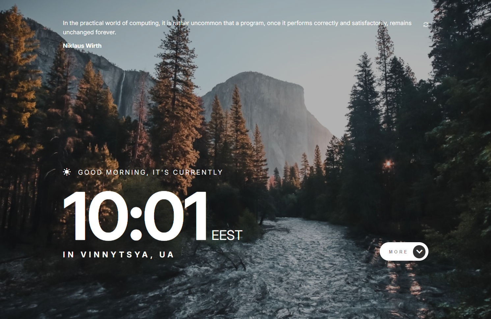
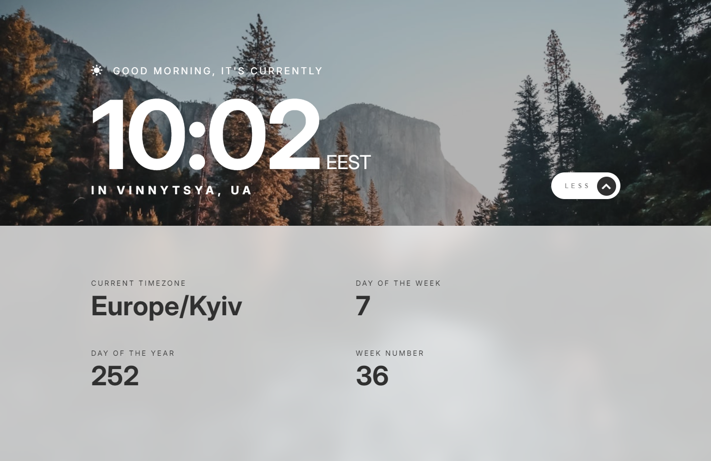
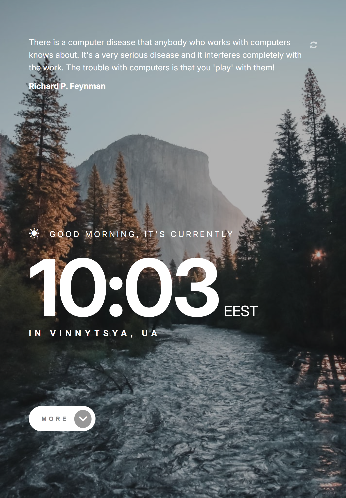
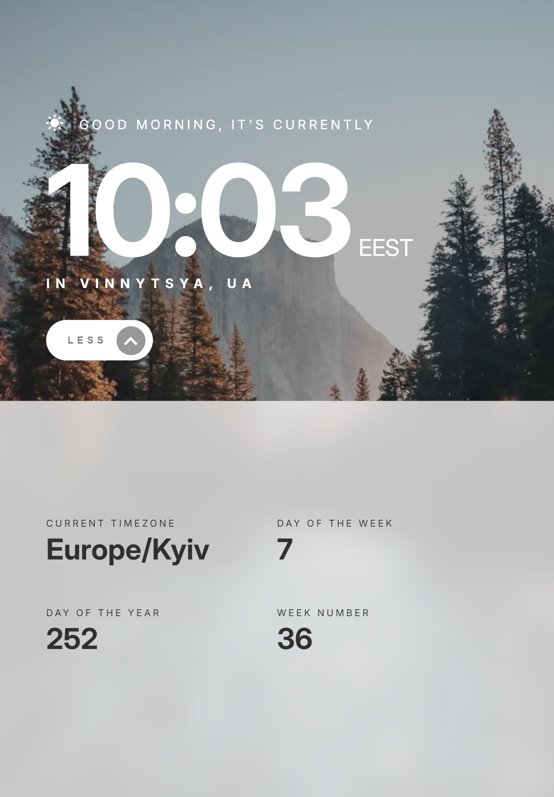

## Table of contents

- [Overview](#overview)
  - [Screenshot](#screenshot)
- [My process](#my-process)
  - [What I learned](#what-i-learned)

## Overview

### Screenshot

### Built with

- Semantic HTML5 markup
- SCSS
- TypeScipty
- [React](https://reactjs.org/) - JS library

### My-process

### What I learned

Building this project i learned and practiced basics of Typescript
